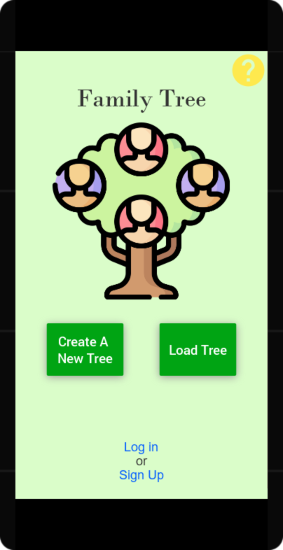

# Family Tree App

## Overview

[Full PDF of App Overview](../App-Overview.pdf "PDF of App-Overview")

## Design Prototype

[My app design and database requirements](https://docs.google.com/document/d/1rfAIHt6zMp2x4XBev02mx7_c323ceJxN4p4SNLDqXg0/edit?usp=sharing)

[Working prototype of primary app design](./design-prototype/index.html) [^1]

[^1]: All the code and webpages were generated by [JUSTINMIND](https://justinmind.com), not myself. I only created the design and functionality therein of the simulted mobile app.

## Deployed App

- [x] Create/Start project
- [ ] Create activities
- [ ] Implement basic functionality
- [ ]  Add bonus gentic funcitonality
- [ ] Polish design and code
- [ ] Finalize name for the app
- [ ] Upload to play store

[My google play store page](https://play.google.com/store/apps/dev?id=5489529430402084829)